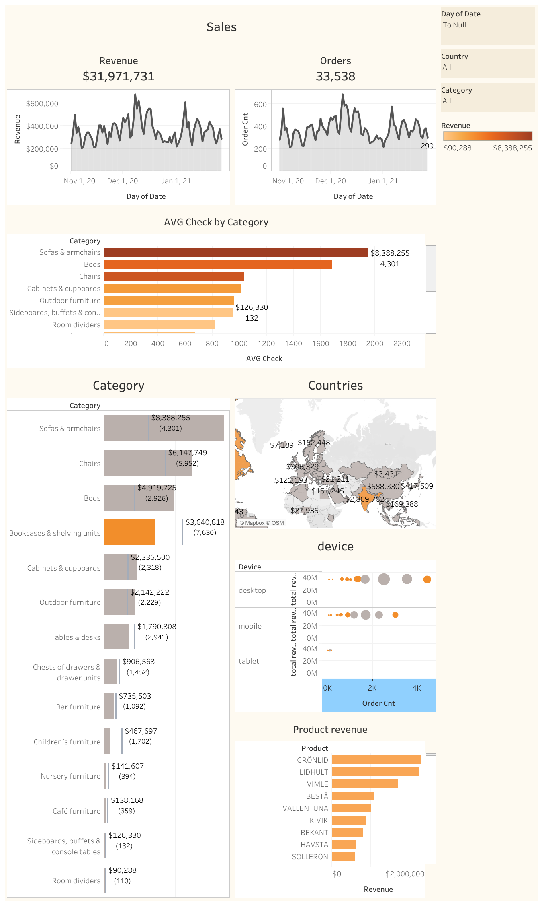

   # E-Commerce Sales Analysis

Analysis of sales and user behaviour of an online furniture store: where the revenue comes from, which products and channels drive it, and which differences between user groups are statistically significant.

**Tools:** SQL (Google BigQuery) · Python (pandas, matplotlib, seaborn, scipy) · Tableau

**Interactive dashboard:** [Tableau Public](https://public.tableau.com/views/Sales2_17846609742150/Sales)

## Data
- E-commerce dataset in Google BigQuery, joined into one table with SQL
- **349,545 sessions**, 18 columns (session, user, device, traffic and product fields)
- Period: **01.11.2020 – 31.01.2021** (orders recorded until 27.01.2021)

## Approach
1. **SQL (BigQuery):** built one dataset with session, user and product fields.
2. **Data description:** column types, missing values, time period, data quality check.
3. **Exploratory analysis:** sales by continent and country, top product categories, devices, traffic sources, registered vs. subscribed users, sales dynamics and weekday seasonality.
4. **Statistical analysis:** correlation analysis, normality tests (Shapiro-Wilk), Mann-Whitney U, Kruskal-Wallis with Dunn's post-hoc test, t-test, Chi-square.
5. **Dashboard** in Tableau Public.

## Key findings
- **The US market dominates:** the Americas generate over 55% of revenue, the US alone about 44%. Top countries: US, India, Canada, UK, France.
- **Same demand everywhere:** the top-10 product categories in the US match the global ranking exactly. Leaders: Sofas & armchairs, Chairs, Beds.
- **Desktop brings 59% of sales**, mobile 39% — but conversion is the same on all devices (~10%, Chi-square p = 0.37).
- **Organic Search is the main channel** (~36% of sales), followed by Paid Search (~27%) and Direct (~23%).
- **More sessions = more sales:** very strong correlation between daily sessions and daily revenue (r = 0.93, p < 0.001).
- **Traffic source does not affect the average order value** (r = 0.03, p = 0.80).
- Sales on different continents move **in sync** (r ≈ 0.67–0.69), which points to a global rather than local demand pattern.

## Files
| File | Content |
|---|---|
| `ecommerce_sales_analysis.ipynb` | full analysis: data description, EDA, statistical tests, conclusions |
| `dataset_query.sql` | SQL query that builds the dataset in BigQuery |
| `dashboard.png` | screenshot of the Tableau dashboard |

## Limitations
Short period (3 months, including the holiday season), a large share of anonymous sessions (~92% without an account), no data on marketing costs, so channel ROI can't be calculated.
